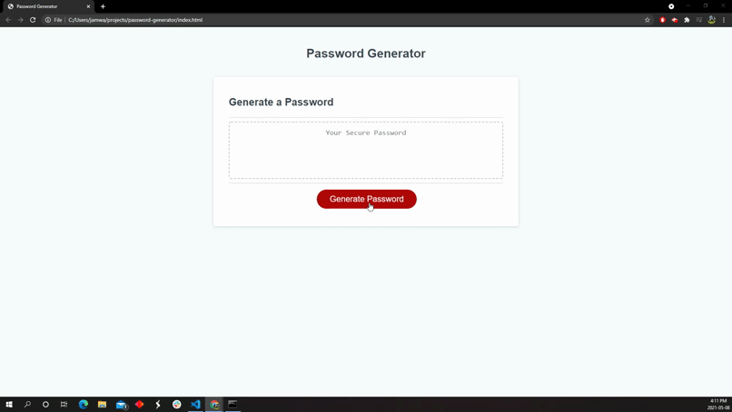

# *Password Generator*
## Version 1.0
### Built with HTML, CSS and JAVASCRIPT
### [Link to "Password Generator" page](https://jamwalab.github.io/Password-generator/)

### Project description
* On clicking password generate ask for password criteria
* Series of questions
    * Password length min 8 characters, max 128.
    * Include lowercase?
    * Include uppercase?
    * Include numbers?
    * Include special characters?

### Build process
* Gather input requirements
    * Password length with input validation (numeric value between 8 - 128).
    * Confirm the below requirements
        * Include lowercase?
        * Include uppercase?
        * Include numbers?
        * Include special characters?   
* Random number generator for repeated use.
* Function with switch case to generate random lowercase, uppercase, number or special character.
* When the generate password is clicked an array is created with true or false based on the password requirements.
* If true the array location is stored in a call array based on the location of true cases in the previous array.
* Location numbers on call array corresponds to the switch case for random character generators.
* A for loop is run until the password length in reached.
* Inside the for loop a random value is selected from the call array and passed as an argument to the function with switch cases.
* Based on the switch value, random character is generated and returned.
* Reurned value are appended to a string and password is displayed on the page.
